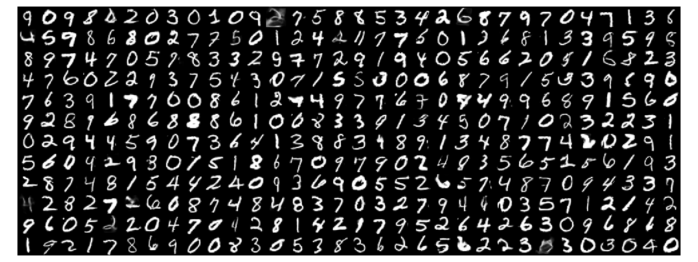

# WGAN-GP

[](http://www.repostatus.org/#concept)
[](https://github.com/dirmeier/wgan/actions/workflows/ci.yaml)

> A Wasserstein GAN with gradient penalty in Flax/NNX

## About

This repository implements the [Wasserstein GAN with gradient penalty](https://arxiv.org/abs/1704.00028) loss for testing.
The implementations are in JAX and Flax/NNX.

## Example usage

An experiment where we train a WGAN-GP on MNIST can be found in [`experiments/mnist/`](experiments/mnist/).
The hyperparameters can be found in [`experiments/mnist/config.py`](experiments/mnist/config.py).
A sample after training 20k steps (i.e., gradient steps) is shown below.

<div align="center">
  
</div>

## Installation

To install the latest GitHub <RELEASE>, just call the following on the
command line:

```bash
pip install git+https://github.com/dirmeier/wgan@<RELEASE>
```

## Author

Simon Dirmeier <a href="mailto:sfyrbnd @ pm me">sfyrbnd @ pm me</a>
